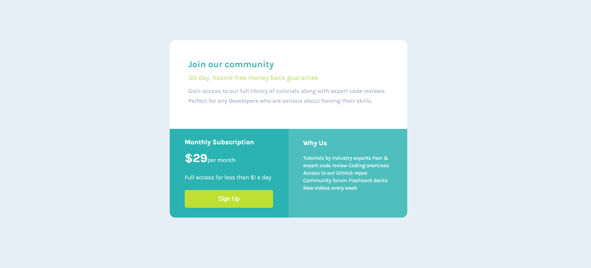

# Title
    single-price-grid-component

# Preview of the App

# Description
    FrontendMentor Challenge

# Stack used :
    HTML // CSS 

## General style :

### Fonts :

- Family: [Karla](https://fonts.google.com/specimen/Karla)

### Colors :

- Cyan: hsl(179, 62%, 43%)
- Bright Yellow: hsl(71, 73%, 54%)
- Light Gray: hsl(204, 43%, 93%)
- Grayish Blue: hsl(218, 22%, 67%)

***
***
***
#### Contact info :

##### oussama Amdouni FrontEnd web-developer

[Portfolio]() | [Linkedin](https://www.linkedin.com/in/usama-amdouni/) | [Github](https://github.com/hernon07) | [Frontend Mentor](https://www.frontendmentor.io/profile/hernon07) | [LeetCode](https://leetcode.com/u/hernon07/)
***
***
***
